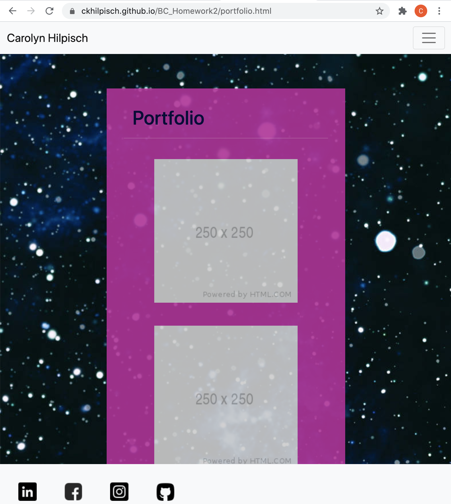
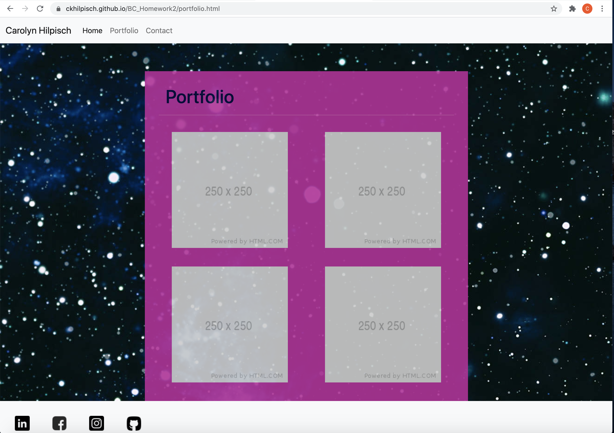
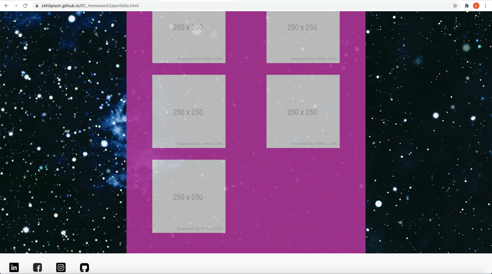

# BC_Homework2
BC_Homework2
For this assignment I was tasked with making a mobile responsive portfolio for myself utilizing both CSS and Bootstrap.  
I created three separate files: 'index.html', 'portfolio.html', and 'contact.html'.  All three pages had a csslink, boostrap link, and javascript link for reference in the head of the page.  
The second step was to name the pages in the Title, and to find a Navbar in Bootstrap and apply it to all three pages.   I named my index.html Carolyn Hilpisch and named the other pages Portfolio and Contact me.  The navbar was the same throughout all 3 pages.  I added the Title of Navbar to the Navbar after that.
I ran into a few problems with the keys in the Navigation.  I intially used the file path to set up the three sites so that a click in the NavBar would take you to the correct site.  Unfortunately it did not work. After some troubleshooting, I figured out a few things that I had set up incorrectly here.   I needed the relative path, so I removed the first part of the path.   I also forgot to remove the # placeholder on the href.   Finally, I had put the Javascript at the top of the page instead of the bottom.   I changed all of these things and was able to have a functioning NavBar!  
After all of that I discovered that I was supposed to do my own CSS to style my page.   I added a style.css file and referenced it in all three pages, making sure to place it underneath the Bootstrap CSS so that all of my styling preferences would take precidence over the predetermined Bootstrap ones.  I also added a couple of different background photos to try out on my pages.
I had a bit of a rough time adding the background image.   It seems so silly now, but I just couldn't get it to work.  I tried container (only filled a portion of the page), I tried * (didn't work at all), tried html, no luck.  I gave it a rest for a bit and added containers to each page to set up the next part of the page and giving the background a rest for awhile.  I eventually was able to do an embedded style and felt resolved to just keeping it that way because I couldn't figure it out.   The HTML validator was having none of it.  😑 So I finally figured it out.   The whole time I had been treating body like a class with a hashtag in front of it.   I was able to make it work by just doing body. When I did my final push, there was no background.   So I did an inspect and found out that the Bootstrap was overriding the background image.   I added a tag of important and it seemed to fix it. I also shortened the tag again.   I seem to be struggling with what is deploying in VS and what is not.
Up next I added a photo of me and started off doing some styling on the page.   I attempted to have all three pages look alike by naming the body container boxed and giving attributes to it.   I added some margins to photos and some font attributes to the heading.   In an attempt to have a line break in the conatiner I tried doing a text-decoration of underline.   Wasn't quite what I was trying to do.
I moved on to breaking up the index page in to two columns within a row.  I decided to have the photo to the left taking up 1/3 of the container.   I spent hours trying to figure out why the text was wrapping under the photo.  It wasn't until I spoke to a TA who pointed out that the text column, with a width of 8, was contained INSIDE the first column, not to the side of it.  *sigh*
I continued to be haunted by bad paths to css.   I was linking to /assets/style.css not assets/style.css.   Fixed that and I was able to have the styling of the page work out.
Next up I attempted to take on the portfolio page.  I wanted to have 5 placeholders for future portfolio work.   I intially started with 350px placeholders and played around with different sizes before landing on 250px.  Intially I did the same set up as the index page (4 column, 8 column).
I came back to the break in the top of the container. I removed the text-decoration underline and opted for the hr tag.  It had the effect I was looking for and was much more aesthetically pleasing.
The portfolio page continued to be my nemesis at every turn.   I was struggling with nesting the columns inside the rows.   I was also grappling with the concept of different column width for different screen sizes.   It was really just eluding me as a concept.   Try as I may, I couldn't lock it down.   and the sizing of the page was looking horrific.   The placeholders would merge and overlap and do the most unflattering things.   I really felt overwhelmed by it.  I tried every type of CSS style change to maybe help.   Different margin and padding combinations, all to no avail.  😖😩 I finally spoke to the indtructor and he suggested image fluid.   I was able to read more about columns and more firmly grasp the concept of nested columns.   I was exhilerated when it finally worked the way I wanted it to.   I truly was ecstatic.  
  
Up next I decided to take on the sticky footer.   Glutton for punishment I guess.   This concept took me to some places.   I read and watched a ton of tutorials on it.   They all seemed to take different approaches.   I started by added the Bootstrap Sticky footer.   I also added the CSS styling that Bootstrap had on the page.   I then wanted to add the Facebook, Instagram, LinkedIn, and Github icons so that when you pressed them it would link you to my pages on all of them.  Played around with a bunch of different icon sizes.   Ended up having to go relatively small, just because the footer being significantly larger than the header looked really incongruent.  So I put the icons and references in as a list.   Then did a CSS of list style of none and floated them left.   That made them all line up in the footer.   I finally found a suggestion for a footer position of sticky, which made the footer stick at the bottom of the page.   I then added a flex to the container about the footer and finally added a bottom margin to the containers.   All of those combined efforts made the sticky footer...STICK.   
While attempting all of the links in the footer I found out the Facebook one was broken.   I fixed that.  
I then moved on to validating all of the code in an HMTL validator.   It was unhappy with the id I put on all the placeholders.  I removed it.  Other than that my HTML was on point.   
I finished up by looking through CSS and cleaning it up by combining elements with identical styling.  
After all of that, here is my webpage:
https://ckhilpisch.github.io/BC_Homework2/

    
    

      

