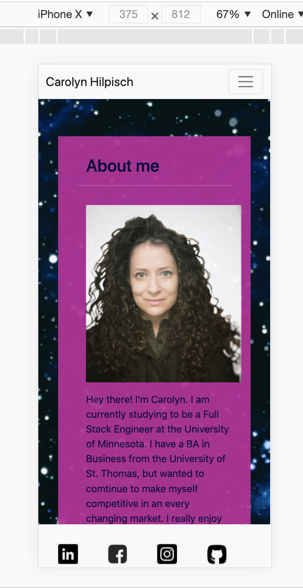

   
# 
 Portfolio Page

## Table of Contents:
<ul>
<li><a href="#description">Description</a></li>
<li><a href="#technologies">Technologies</a></li>
<li><a href="#usage">Usage</a></li>
<li><a href="#visuals">Visuals</a></li>
<li><a href="#testing">Testing</a></li>
<li><a href="#questions">Questions</a></li>
<li><a href="#license">License</a></li>
</ul>

## 
 Description : 

Making a Portfolio page for myself that is useful for people interested in employing me.   I created three separate pages, with an about me page, a portfolio page, and a contact page.  All three were styled the same and had links via the Navigation Bar to reach the other pages.   Links to all of my social sites - LinkedIn, Facebook, Instagram, and Github - were included on each page in a sticky footer.   THe pages are mobile responsive, with mobile-first the priority.

## 
 Technologies :

### CSS
### Bootstrap
### Javascript
### HTML

## 
  Usage :

This website is for prospective employers.  It is showcasing my talents.

### The Webpage :
https://ckhilpisch.github.io/Portfolio/

 
 

## 
 Visuals :

 

## 
 Contributing :

Pull requests are always welcome.  When contributing to this repository, please first discuss the change you wish to make via email or issue.  
After approval, please follow the "fork-and-pull" Git workflow.
<ol>
<li>Fork the repo on GitHub</li>
<li>Clone the project to your own machine</li>
<li>Commit changes to your own branch</li>
<li>Push your work back up to your fork</li>
<li>Submit a Pull request so that we can review your changes</li>
</ol>

## 
 Questions : 

If you have any questions, feel free to reach out to me.   My email is ckhilpisch@gmail.com.

## 
 License : 

MIT License
Informataion avaiable here: 
https://opensource.org/licenses/MIT

    
    

      

